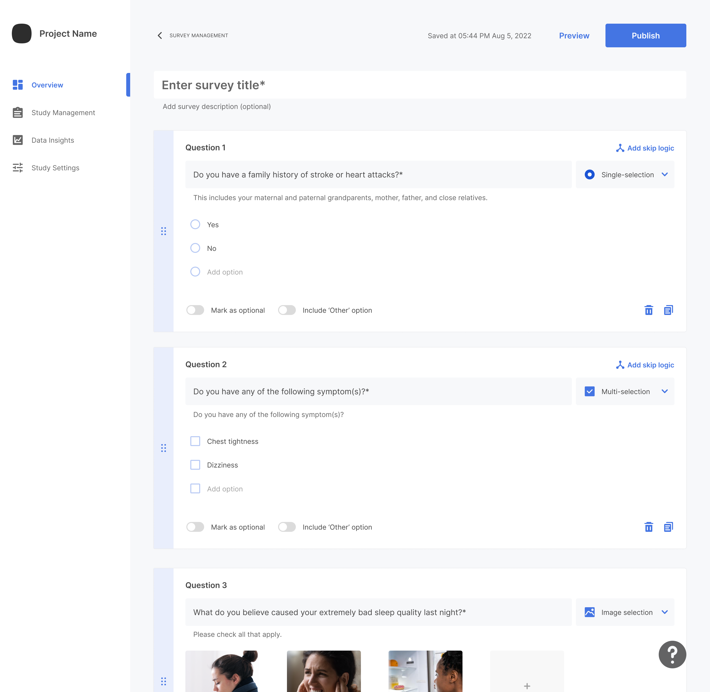

# Survey Branching

- The “Add skip logic” button will only be visible in a question card when
  - There’re >= 2 questions in this survey, and will only be visible for 
    - Single-selection questions
    - Multi-selection questions
    - Dropdown questions
    - The questions that are not the last question in this survey
- E.g., for a single-selection question which is the last question in a survey, the “Add skip logic” button won’t be dispalyed.

